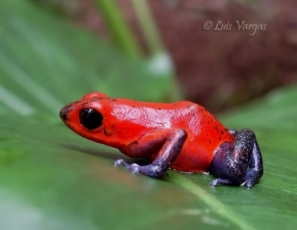
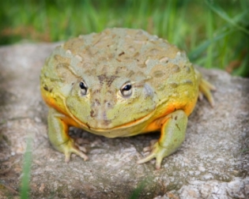
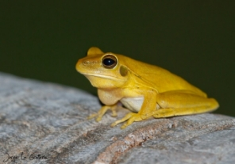
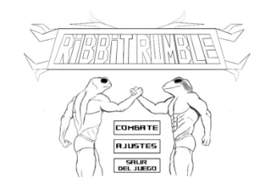
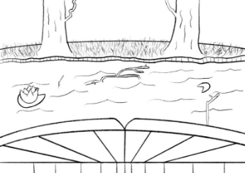

Carlos Santayana Vicente                         Juegos en Red

Marcos De Ozaeta Cabadas			 Madrid (Quintana)

Alejandro Pérez Carretero         3º Grado en Diseño y Desarrollo de Videojuegos

Sebastián Loges de Faria

**Documento de Diseño del Juego “Ribbit Rumble”**

# Índice
[1.	Introducción	3](#_toc148127064)

[2.	Personajes	3](#_toc148127065)

[3.	Mecánicas	5](#_toc148127066)

[4.	Estado del Juego	8](#_toc148127067)

[5.	Interfaces	9](#_toc148127068)

[6.	Niveles	13](#_toc148127069)

[7.	Música y Sonidos	14](#_toc148127070)

1. # Introducción
**Ribbit Rumble** es un juego en red multijugador perteneciente al género de lucha, donde dos jugadores lucharán entre ellos en cada partida. Los personajes del juego están tematizados con ranas cuyas habilidades en combate dependerán de su especie.

El videojuego tiene una calificación PEGI 12, ya que es apto para todos los públicos, pero puede contener escenas que podrían afectar a algunos jugadores. Se busca atraer la atención de un público casual, que disfrute de los juegos de lucha donde puedan emplear diversas estrategias para vencer a su contrincante.

El estilo artístico del videojuego es “cartoon 2D”. Este estilo ayudará a transmitir a los jugadores un ambiente divertido y gracioso dentro del juego.

**Ribbit Rumble** será el primer juego de la saga, con el que buscamos conseguir la mayor cantidad de jugadores posible, que estén interesados en los enfrentamientos uno contra uno. El videojuego estará disponible para PC a través de diversas tiendas digitales. De esta manera, al ser una de las plataformas con más usuarios actualmente, el juego estará al alcance de un alto porcentaje de jugadores.

La jugabilidad en red se conseguirá con una arquitectura cliente/servidor, con una comunicación sustentada por una API REST y WebSockets. Un ordenador actuará como servidor mientras que otros dos actuarán como clientes. 
1. # Personajes
Los jugadores podrán escoger entre 4 personajes distintos, basados en ranas de diferentes especies, como se mencionó anteriormente:

- **La Rana de Lluvia**, científicamente conocida como “***Breviceps gibbosus”,*** es una rana africana cuyas principales características son la forma esférica de su cuerpo y sus ojos oscuros, que le dan un aspecto de caricatura. 

**“Rana de Lluvia”                                   “Concept Rana de Lluvia”**

- **Rana Punta de Flecha**, con “***Dendrobatidae*”** como su nombre científico**,** originaria de América del Sur, es una rana venenosa que llama la atención de sus depredadoras con sus patrones y colores brillantes, cuanto más llamativos son, más tóxico es el contacto con estas.

!

!

`    		`**“Rana Punta de Flecha”		“Boceto de personaje Punta de Flecha”**

- **Rana Toro**, conocida también por su nombre científico “***Lithobates catesbeianus”***, presente en muchos continentes, es una especie que puede llegar a medir 20 cm de largo y llegar a pesar casi un kilo. 

`                                                                                               `

**“Rana Toro”				“Boceto de personaje Rana Toro”**

- **Rana Trepadora,** cuyo nombre científico es “***Boana pulchella***”, se distribuye por la mayor parte de América de Sur, en arroyos y lagunas. Se caracteriza por su piel de color verde o amarillo uniforme, su pequeño tamaño y el volumen de su saco vocal al hincharse. 

**“Rana Trepadora”			    “Boceto de personaje Rana Trepadora”**

1. # Mecánicas
La perspectiva del juego será una cámara lateral fija que mostrará todo el escenario donde se desarrollará el combate.

El juego compartirá muchas mecánicas presentes en otros videojuegos del género de lucha. Empezando por el movimiento básico del personaje, los jugadores podrán moverse a la izquierda y a la derecha, así como saltar y agacharse. Las teclas que permitirán esto son la “A”, “D”, “W” y la “S”.  

Cada jugador tendrá una barra de vida, una barra de habilidad especial y un contador de rondas, que se podrán consultar en la interfaz que estará sobre la pantalla en la zona superior.

Los jugadores podrán atacar al pulsar la tecla “F”, siendo este un ataque distinto dependiendo del estado en el que esté (agachado, en el aire…), asimismo, se podrán bloquear los golpes presionando la tecla “G”, que reducirá en parte el daño producido por el golpe. El medidor de la habilidad especial se va llenando conforme se aciertan golpes y se bloquean ataques, cuando este está lleno, el jugador podrá realizar un ataque especial al pulsar a la vez las teclas “F” y “G”.

En la siguiente tabla se muestran los controles para ambos jugadores en función del modo de juego seleccionado:

<table><tr><th rowspan="2">Acción</th><th colspan="3" valign="bottom">Modo de Juego</th></tr>
<tr><td valign="bottom">Red</td><td colspan="2" valign="bottom">Local</td></tr>
<tr><td valign="bottom">Moverse a la derecha</td><td valign="bottom">D</td><td valign="bottom">D</td><td valign="bottom">→</td></tr>
<tr><td valign="bottom">Moverse a la izquierda</td><td valign="bottom">A</td><td valign="bottom">A</td><td valign="bottom">←</td></tr>
<tr><td valign="bottom">Saltar</td><td valign="bottom">W</td><td valign="bottom">W</td><td valign="bottom">↑</td></tr>
<tr><td valign="bottom">Agacharse</td><td valign="bottom">S</td><td valign="bottom">S</td><td valign="bottom">↓</td></tr>
<tr><td valign="bottom">Ataque básico</td><td valign="bottom">F</td><td valign="bottom">F</td><td valign="bottom">Numpad 1</td></tr>
<tr><td valign="bottom">Ataque bajo</td><td valign="bottom">S+F</td><td valign="bottom">S+F</td><td valign="bottom">↓+ Numpad 1</td></tr>
<tr><td valign="bottom">Ataque ascendente</td><td valign="bottom">W+F</td><td valign="bottom">W+F</td><td valign="bottom">↑+ Numpad 1</td></tr>
<tr><td valign="bottom">Ataque aéreo (en el aire)</td><td valign="bottom">F </td><td valign="bottom">F</td><td valign="bottom">Numpad 1</td></tr>
<tr><td valign="bottom">Bloquear</td><td valign="bottom">G</td><td valign="bottom">G</td><td valign="bottom">Numpad 2</td></tr>
<tr><td valign="bottom">Ataque especial</td><td valign="bottom">F+G</td><td valign="bottom">F+G</td><td valign="bottom">Numpad 1+ Numpad2</td></tr>
</table>

|Leyenda| |
| :- | :- |
| |Jugador 1 y 2|
| |Jugador 1|
| |Jugador 2|

A continuación, se detallan los ataques de cada personaje, así como sus estadísticas:

La mayoría de los ataques variarán en la velocidad y la animación para cada personaje. Todos los ataques tienen el mismo alcance a excepción del ataque especial:

**Rana de Lluvia:** Sus ataques tienen una velocidad normal, un daño moderado, y se basan en el movimiento del cuerpo completo del personaje (aprovechando así su forma esférica):

-Ataque básico: Embiste hacia delante con su cuerpo.

-Ataque bajo: Rueda hacía la rana rival, causando daño y empujándolo.

-Ataque ascendente: Salta y hace un “backflip”, con las patas delanteras estiradas.

-Ataque aéreo: Da una vuelta completa en horizontal con ambas patas estiradas.

-Bloqueo: Se da la vuelta para enseñar la parte trasera de su cuerpo.

-Ataque especial: Bosteza mientras hace un sonido que adormece al enemigo por unos segundos. Aunque se le golpee, este no despierta hasta que se acabe el efecto de la habilidad.

**Rana Punta de Flecha:** Sus ataques tienen una alta velocidad, daño por debajo de la media y utiliza sus patas delanteras y su lengua para atacar:

-Ataque básico: Realiza una “bofetada” con una de sus patas delanteras.

-Ataque bajo: Mientras está agachada, saca la lengua para atacar a lo que tiene enfrente.

-Ataque ascendente: Salta mientras mueve las patas delanteras hacia arriba.

-Ataque aéreo: Se inclina ligeramente mientras mueve las patas delanteras hacia abajo.

-Bloqueo: Se agacha y se cubre los ojos con las patas delanteras.

-Ataque especial: Salta hacia posicion del enemigo y lo envenena, bajándole vida de manera periódica por unos segundos. 

**Rana Toro:** Sus ataques son lentos, pero bastante fuertes y utiliza su cabeza y su gran cuerpo para atacar:

-Ataque básico: Da un cabezazo hacia delante.

-Ataque bajo: Apoyada sobre su propio cuerpo, hace un aplauso con las patas delanteras.

-Ataque ascendente: Salta con la cabeza por delante para dar un cabezazo hacia arriba.

-Ataque aéreo: Extiende sus patas haciendo daño a todo lo que esté alrededor de este.

-Bloqueo: Llena su saco protegiéndolo por delante.

-Ataque especial: Saca la lengua y lleva al rival a su boca, manteniéndolo encerrado dos segundos hasta que lo escupe. En ese proceso el rival pierda la mitad de su vida actual.

**Rana Trepadora:** Sus ataques tienen una velocidad estándar con daño moderado y utiliza principalmente su lengua para atacar:

-Ataque básico: Saca la lengua para atacar justo enfrente suya.

-Ataque bajo: Mientras está agachada, saca la lengua para atacar por debajo.

-Ataque ascendente: Saca la lengua con un ángulo de 45º.

-Ataque aéreo: Hincha su saco bocal mientras está en el aire, haciendo un poco de daño al que esté cerca.

-Bloqueo: Levanta la cabeza e hincha su saco bocal.

-Ataque especial: Pega un latigazo delante de él con su lengua, causando un golpe poderoso en el rival.

1. # Estado del Juego
En este apartado se muestra de forma gráfica los estados por los que se va a mover el juego. Se empieza en el “Menú Principal” desde el cual se puede acceder al “Menú de selección de Modo” y “Menú de Ajustes”. Siguiendo el flujo, después de elegir el modo de juego y los personajes, los jugadores escogerán el escenario donde lucharán en “Selección de Mapa”, luego pasan al estado de “Juego” donde se desenvolverá el mismo. 

Al acabar la partida se mostrará una “Pantalla de Resultados” con una serie de estadísticas. Desde este estado se puede seguir el flujo hacia el “Menú Principal” o a la “Selección de Personajes” en caso de querer empezar rápidamente una nueva partida. Desde ciertos estados se permite un flujo de ida y vuelta, como por ejemplo entre el “Menú Principal” y el “Menú de Ajustes”.

***” Diagrama de Estados del Juego”***
1. # Interfaces
En cuanto a las interfaces del juego, estas se detallan a continuación:

- **Menú Principal:** Con el título del juego en la parte superior y dos ranas haciendo un pulso, el menú principal es la primera pantalla que verán los jugadores. En ella el jugador podrá pulsar tres botones:

- **Combate:** Con este botón se le dará a elegir al jugador entre juego en local o en red.
- **Ajustes:** Con este botón se abrirá el menú de ajustes.
- **Salir del juego:** Con este botón se cerraré el juego.

***“Concept de la Interfaz del menú principal”***

- **Menú de Ajustes:** En este menú se podrán cambiar diferentes parámetros.

- **Volumen general:** Controla el volumen general del juego, en el que se incluyen la música y los efectos de sonido.
- **Volumen de la música:** Controla el volumen de la música de forma independiente al resto de sonido.
- **Volumen de efectos de sonido:** Controla el volumen de los efectos de sonido del juego (golpes, acciones, …).
- **Brillo:** Controla el brillo de la pantalla.

***“Concept de la Interfaz de menú de ajustes”***

- **Menú de Selección de Personajes:** En el centro de la pantalla están los “logos” de los cuatro personajes jugables, a los lados de la pantalla se mostrará un dibujo cuerpo completo de la rana escogida por el jugador 1 y 2 respectivamente. Ambos jugadores podrán elegir la misma rana.

***“Concept del Menú de selección de Personajes”***

***”Dibujo de los personajes cuerpo completo”***

- **Menú de Selección de Mapa:** En el centro de la pantalla se dispondrán tres mapas y una cuarta opción, que consiste en elegir uno de los tres mapas anteriores de forma aleatoria. En el mapa que elija cada jugador saldrá J1 o J2, para aclarar cual ha elegido cada uno. Además, a ambos lados de la pantalla saldrá el mapa en grande elegido por cada jugador y cuando se seleccionen los mapas, se decidirá cual se utiliza a modo de parpadeo entre ambos mapas y el elegido se iluminará.

***“Concept de la Interfaz de selección de mapas”***

- **Interfaz en Partida:** Dentro de la partida la interfaz estará situada en la zona superior de la pantalla, mostrando el icono del personaje de ambos jugadores, sus barras de vida y habilidades especiales. En el centro de esta interfaz se encuentra el temporizador de la partida y el contador de rondas ganadas, simbolizadas con unas fichas con un dibujo de la cabeza de unas moscas.

***“Concept de la Interfaz InGame”***

- **Pantalla de Resultados:** En la pantalla de resultados se mostrarán los personajes utilizados en pose de victoria o derrota según el jugador que haya ganado y perdido, además también se mostrarán el número de rondas ganadas por cada jugador en la partida y la duración total de esta.

***“Concept de la Pantalla de Resultados con Rana Toro (Izquierda) como ganador y Rana Punta de Flecha (Derecha) como perdedor”***
1. # Niveles
**Jungla:**

En este escenario la pelea se desarrolla en un tronco de madera que flota en un rio en la selva. La base del escenario (el propio tronco) ocupa de un lado a otro de la pantalla, y al fondo se van viendo la espesa vegetación y los árboles de la selva que se van moviendo hacia la derecha, simulando que el tronco va rio abajo. Entre el tronco y la vegetación, se ve el agua del rio que va cambiando y formando ondulaciones, simulando la corriente.

***“Boceto del escenario Jungla”***

**Desierto:** 

La pelea toma lugar encima de unos ladrillos que eran parte de una vieja pirámide. Alrededor se puede ver una barrera de cactus y entre estas y el suelo hay un montículo de arena que tapa el otro extremo de los ladrillos. Detrás de los cactus se puede ver una explanada de arena y rocas pequeñas. A lo lejos se puede apreciar una enorme pirámide en contraste con el cielo, en el lado contrario a este hay un oasis con palmeras que se reflejan sobre el agua cristalina. A lo largo de la batalla las nubes del cielo se van desplazando desde la izquierda hasta la derecha, así como rayos del sol que van apareciendo y desapareciendo sobre el escenario.

***“Boceto del escenario del Desierto”***

**Nenúfar:**

En este escenario los jugadores pelearan encima de un nenúfar. Se encuentra en un lago en medio del bosque, de fondo se verán dos árboles frondosos, el nenúfar donde batallan las ranas subirá y bajará poco a poco por los efectos de la batalla. 

***“Boceto del Nenúfar”***

1. # Música y Sonidos
En el Menú principal sonará una canción de rock para acompañar a la imagen de las ranas musculadas, esta misma seguirá sonando en bucle hasta que se entre en una partida, donde empezará a sonar una canción concreta en función del mapa, pero con la diferencia de que estas tendrán un tono más gracioso que acompañará a la apariencia “cartoon” de los personajes, que como ya se vio en apartados anteriores, no es la misma que los jugadores han visto en las escenas anteriores. Además de la música de fondo, también se escucharán efectos especiales tanto de la batalla como del escenario. 

En el escenario de la selva, entre los efectos especiales, se escuchará como el agua del mapa sigue la corriente y sonidos de ambiente de insectos y animales comunes de la selva.

En el mapa del desierto, los efectos especiales que se escucharán en este mapa serán ventiscas y graznidos de buitres.

Por último, en el mapa del Nenúfar se escucharán “ribbits” de ranas y chapoteos en el agua.

En cuanto a los efectos especiales de los personajes, cada ataque tendrá un sonido acompañando a la animación, el cual sonará distinto en el caso de ser bloqueado por el rival. Cada vez que se gane una ronda, la rana ganadora hará un “ribbit” mientras se prepara la siguiente ronda. 

En la pantalla de resultados, sonarán aplausos mientras que de fondo se escuchan “ribbits” de la rana ganadora.  
#
2

